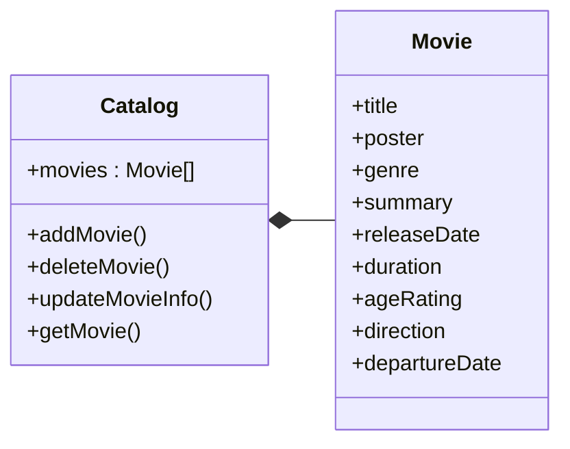

# Projeto Integrador – Cloud Developing 2026/1

> CRUD simples + API Gateway + Lambda `/report` + RDS + Front

## Grupo

1. RA - Carolina Sun - Infraestrutura AWS / Frontend
2. RA - Nome - Backend / API
3. RA - Nome - Banco de Dados
4. RA - Nome - Dockerização / Deploy
5. RA - Nome - Documentação / Testes

---

# 1. Visão geral

O projeto consiste no desenvolvimento de uma aplicação web para gerenciamento de um catálogo de filmes utilizando serviços da Amazon Web Services (AWS).

O sistema permite realizar operações CRUD (Create, Read, Update e Delete) sobre os filmes cadastrados, incluindo funcionalidades de criação, edição, listagem e remoção de registros.

Além das funcionalidades principais do CRUD, a arquitetura também inclui um endpoint serverless `/report`, implementado utilizando AWS Lambda. Essa função é responsável por consumir a API principal e gerar estatísticas sobre os filmes cadastrados, como:

* Top 5 gêneros mais frequentes
* Filme mais longo
* Filme mais curto

O projeto foi desenvolvido com foco na aplicação prática de conceitos de computação em nuvem, incluindo:

* Isolamento de rede com VPC
* Banco de dados gerenciado
* Containerização com Docker
* Arquitetura serverless
* API Gateway
* Segurança via Security Groups

---

# 2. Arquitetura

| Camada    | Serviço                      | Descrição                              |
| --------- | ---------------------------- | -------------------------------------- |
| Front-end | EC2 + Docker                 | Interface web da aplicação             |
| Back-end  | EC2 + Docker                 | API REST responsável pelo CRUD         |
| Banco     | Amazon RDS Aurora PostgreSQL | Banco relacional em subnets privadas   |
| Gateway   | Amazon API Gateway           | Rotas CRUD → EC2 · `/report` → Lambda  |
| Função    | AWS Lambda                   | Consome a API e gera estatísticas JSON |
| Rede      | AWS VPC                      | Isolamento da infraestrutura           |

---

# 3. Como rodar localmente

## Pré-requisitos

Antes de iniciar o projeto, é necessário possuir instalado:

* Docker
* Docker Compose
* Git
* Node.js

---

## Clonando o repositório

```bash
git clone <repository-url>
cd movie-catalog
```

---

## Configuração das variáveis de ambiente

Crie um arquivo `.env` na raiz do projeto:

```env
DB_HOST=
DB_PORT=
DB_USER=
DB_PASSWORD=
DB_NAME=
```

---

## Executando a aplicação

```bash
docker compose up --build
```

---

## Endpoints locais

Frontend:

```text
http://localhost:3000
```

Backend:

```text
http://localhost:8080
```

---

# 4. Estrutura do projeto

```bash
movie-catalog/
│
├── backend/
│   ├── controllers/
│   ├── services/
│   ├── repositories/
│   ├── routes/
│   └── Dockerfile
│
├── frontend/
│   ├── src/
│   └── Dockerfile
│
├── lambda/
│   └── report-function/
│
├── docs/
│   └── arquitetura.png
│
├── docker-compose.yml
└── README.md
```

---

# 5. Infraestrutura AWS

Toda a infraestrutura foi criada dentro de uma Virtual Private Cloud (VPC), garantindo isolamento lógico e maior segurança da aplicação. 

## Componentes utilizados

* VPC
* Subnets públicas
* Subnets privadas
* Route Tables
* Internet Gateway
* Security Groups
* Amazon EC2
* Amazon RDS
* API Gateway
* AWS Lambda

---

# 6. Banco de dados

O banco de dados foi implementado utilizando Amazon Aurora PostgreSQL Compatible.

## Características

* Compatibilidade com PostgreSQL
* Serviço gerenciado
* Backups automáticos
* Alta disponibilidade

  ## Diagrama de Domínio


## Modelo Entidade-Relacionamento


<hr>


## Segurança

O banco:

* Não possui acesso público
* Está localizado em subnets privadas
* Só pode ser acessado internamente pela VPC

---

# 7. Backend

O backend implementa um CRUD para gerenciamento do catálogo de filmes.

## Funcionalidades

* Criar filmes
* Listar filmes
* Editar filmes
* Remover filmes

## Arquitetura em camadas

### Controllers

Responsáveis pelo tratamento das requisições HTTP.

### Services

Responsáveis pela lógica de negócio.

### Repositories

Responsáveis pelo acesso ao banco de dados.

---

# 8. Frontend

O frontend consome a API utilizando requisições HTTP assíncronas.

## Tecnologias utilizadas

* TypeScript
* Fetch API
* Async/Await

## Comunicação com backend

As operações do frontend refletem diretamente as rotas disponíveis no backend.

---

# 9. API Gateway

O Amazon API Gateway foi utilizado como camada central de entrada da aplicação.

## CRUD

Foi utilizado o recurso:

```text
/{proxy+}
```

com o método:

```text
ANY
```

Essa abordagem permite encaminhar múltiplas rotas diretamente para o backend hospedado na EC2.

---

## Endpoint `/report`

A rota `/report` está integrada diretamente à função AWS Lambda responsável pela geração dos relatórios estatísticos.

---

# 10. AWS Lambda

A função Lambda consome os dados da API do backend e gera estatísticas em formato JSON.

## Estatísticas geradas

* Top 5 gêneros mais comuns
* Filme mais longo
* Filme mais curto

## Características

* Stateless
* Processamento em memória
* Sem acesso direto ao banco de dados

---

# 11. Segurança

A aplicação utiliza mecanismos de segurança tanto em nível de infraestrutura quanto em nível de aplicação.

## Security Groups

As regras de inbound permitem:

* Acesso público apenas ao frontend
* Restrição de acesso ao backend
* Bloqueio de acesso externo ao banco de dados

## Variáveis de ambiente

As credenciais do banco são armazenadas via variáveis de ambiente e injetadas nos containers utilizando Docker Compose.

---

# 12. Limitações atuais

A solução atual possui algumas limitações:

* Frontend e backend executando na mesma EC2
* Ausência de Auto Scaling
* Ausência de Load Balancer
* Deploy manual
* Sem CI/CD
* Sem autenticação de usuários
* Sem monitoramento avançado

---

# 13. Possíveis evoluções

Como melhorias futuras:

* Separação frontend/backend em instâncias distintas
* Uso de Application Load Balancer
* Auto Scaling Groups
* ECS/EKS
* Pipeline CI/CD
* Sistema de autenticação
* Observabilidade e monitoramento

---

# 14. Tecnologias utilizadas

## Cloud

* AWS EC2
* AWS VPC
* AWS RDS
* AWS Aurora PostgreSQL
* AWS Lambda
* AWS API Gateway

## Backend

* Node.js
* Express
* PostgreSQL

## Frontend

* TypeScript
* Fetch API

## Infraestrutura

* Docker
* Docker Compose

---

# 15. Objetivo acadêmico

O projeto foi desenvolvido com finalidade acadêmica para demonstrar conhecimentos relacionados a:

* Computação em nuvem
* Arquitetura cliente-servidor
* Dockerização
* Infraestrutura AWS
* Serviços gerenciados
* Segurança em nuvem
* Arquitetura serverless

---

# 16. Licença

Este projeto possui finalidade exclusivamente educacional e acadêmica.
