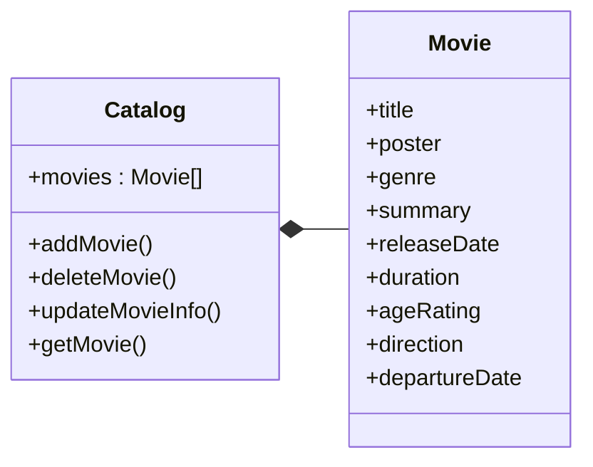

# 2026.1-ServicosNuvem
Código fonte desenvolvido para o projeto da disciplina de serviços em nuvem.

## Diagrama de Domínio

```mermaid
classDiagram
direction LR

class Movie {
  +title
  +poster
  +genre
  +summary
  +releaseDate
  +duration
  +ageRating
  +direction
  +departureDate
}

class Catalog {
  +movies : Movie[]
  +addMovie()
  +deleteMovie()
  +updateMovieInfo()
  +getMovie()
}

Catalog *-- Movie
```
## Modelo Entidade-Relacionamento

