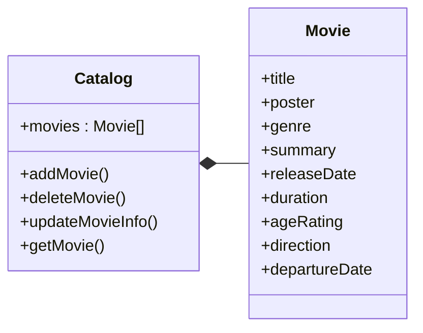

# 2026.1-ServicosNuvem
Código fonte desenvolvido para o projeto da disciplina de serviços em nuvem.

## Especificação do projeto 


## Diagrama de Domínio


## Modelo Entidade-Relacionamento


<hr>

# Template do README! NÃO ESQUECER DE FAZER

# Projeto Integrador – Cloud Developing 2025/1

> CRUD simples + API Gateway + Lambda /report + RDS + Front

**Grupo**:
<!-- no máximo 5 alunos -->

1. RA - nome - responsabilidade
1. RA - nome - responsabilidade
1. RA - nome - responsabilidade
1. RA - nome - responsabilidade
1. RA - nome - responsabilidade

## 1. Visão geral
<!-- Descreva rapidamente o domínio escolhido, por que foi selecionado e o que o CRUD faz. -->

## 2. Arquitetura


| Camada | Serviço | Descrição |
|--------|---------|-----------|
| Back-end | ECS Fargate (ou EC2 + Docker) | API REST Node/Spring/… |
| Front-end | ECS Fargate (ou EC2 + Docker) | Node/Spring/… |
| Banco   | Amazon RDS              | PostgreSQL / MySQL em subnet privada |
| Gateway | Amazon API Gateway      | Rotas CRUD → ECS · `/report` → Lambda |
| Função  | AWS Lambda              | Consome a API, gera estatísticas JSON |


## 3. Como rodar localmente

```bash
cp .env.example .env         # configure variáveis
docker compose up --build
# API em http://localhost:3000
